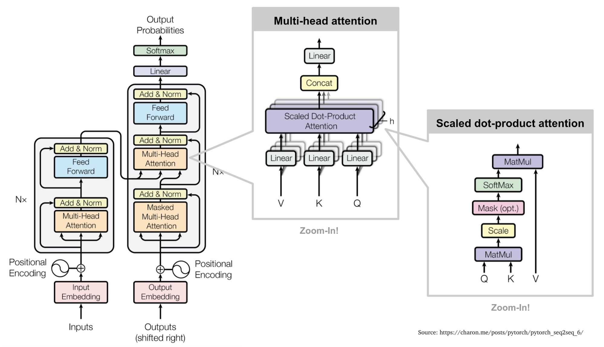

This is the first of a three part blog post series in which we are going to develop a 
Transformer based name generator

* 1. Exploring the model and generating the first names
* 2. Evaluate the quality of the generated names
* 3. Perform hyper parameter tuning to better understand the model architecture and improve data quality

## Overview and Introduction
In this blog post series you will learn how to build a pytorch model that learns
to generate new names from a list of examples.

The machine learning model will be based on the very successful and widely applied
transformer architecture.
For a excellent introduction to transformers and self attention as their key
idea have a look a [this blog post by Peter Bloem](http://peterbloem.nl/blog/transformers).

Once we have trained our model and used it to generate a set of names, we are going
to focus on evaluating the generated names, discussing what we want to achieve
with a generative model and how to quantify the data quality.

Once we have some good data quality metrics, we shift our focus on hyperparameter
tuning with [wandb](https://docs.wandb.ai/quickstart) to improve our results
and in addition get a better understanding of our model.

I hope you are looking forward to this series and find it useful and inspiring.

## Project Repository and System configuration
All the code for this tutorial series is available on github as the
[onomatico](https://github.com/mapa17/onomatico) project.

The project makes use of [poetry](https://python-poetry.org/docs/basic-usage/) 
as the dependency management system, and I as always recommend to work with your
python projects in a virtual environment that is build with conda + pip.

If working locally is not an option for you, or you want to make use of the power
of the cloud, I recommend to check out an previous blog post that helps you to
[setup your ML development environment in the cloud in less than 5 min](ML_dev_deployment_on_AWS.md).

## Lets start with the beginning, the training data
The goal of this tutorial is to build a generative model that is capable of creating
american name pairs of first and last names. As all machine learning models we
need training data to teach the model based on positive examples what "good" names
look like.

The training data we are going to use are build based on a set of the 100 most
common american first and last names available [here](https://github.com/fivethirtyeight/data/tree/master/most-common-name).

To be more precise, I have taken the 100 most common last names, and have combined
them with 10 random picked first names from the 100 most common first names.

The result is a data set of 1000 name combinations from which we will take 900
to train our generative model and 100 to guide the training process.

## Project Structure and Components
Once you cloned the project repo [onomatico](https://github.com/mapa17/onomatico) (for the curious, the name was inspired by a wordplay on [onomatics](https://en.wikipedia.org/wiki/Onomastics), the study of names.) you can find the following
project structure

* **main folder**: several configuration files to setup the project and configure additional tools (poetry, wandb) 
* **data folder**: the training and test data used in this blog post
* **onomatico**: the python modules tha are used to train a model and generate new names
* **deployment**: Terraform configuration and system configuration files to launch AWS instances (fore more details [see](ML_dev_deployment_on_AWS.md) 

For the rest of this tutorial we will focus on the `onomatico` folder that contains `onomatico/main.py`
which provides the frontend in the form of an CLI application and `onomatico/utils`
that provides two python modules to help access the training data `onomatico/utils/Names.py`
and defines our model `onomatico/utils/Transformer.py`.

We start with the last two files, explaining first the model and than how to access the training data.

## A Transformer based generative Character Model
The code used in this model is derived from the official [Transformer Tutorial](https://pytorch.org/tutorials/beginner/transformer_tutorial.html)
and contains the main Transformer class that is building a Transformer model
on sequences of individual characters.

The class constructor, combines multiple [TransformerEncoderLayers](https://pytorch.org/docs/stable/generated/torch.nn.TransformerEncoderLayer.html)
(which make up the heart of the Transformer) preceded by an Embedding layer
that learns distributed representations of our tokens and a positional encoding function
that modulates the embedded tokens to retain information about their position
in the input sequence. At the output of the Transformer we have a linear layer
that maps to our set of tokens, which in our case are individual characters.

An overview of the Transformer architecture you can see in the following diagram
(taken form [this blog post](https://charon.me/posts/pytorch/pytorch_seq2seq_6/))


Lets have a look at `onomatico/utils/Transformer.py` in a bit more detail

[[INCLUDE onomatico/utils/Transfoermer.py]]

For a discussion about the architecture of Transformers I can recommend
[this](https://e2eml.school/transformers.html)
and [the following](https://towardsdatascience.com/transformers-explained-visually-not-just-how-but-why-they-work-so-well-d840bd61a9d3) reference.


With the hyperparameter that are provided during the constructor of the class we
can change the architecture of our model by for example increasing the size of
the internal embedding layers used in `TransformerEncoderLayers`, the number of
heads or the number of layers themselves. In addition we are specifying the
number of tokens in our vocabulary for the model to be able to read all inputs
and generate names containing only characters that are present in our vocabulary.

Finding the best hyper parameters for our model is a challenging task, and we will
discuss it later in detail, but for now, as a quick peek, we will see that increasing
the embedding sizes has little positive effect on data quality, but increasing
the number heads does.

## Loading and Preprocessing of the dataset
The dataset is a csv file containing in a single column the first and last name.
Whereby the last name is spelled on purpose in all capital letters.

Example
```csv
name
Jeffrey SMITH
Amanda SMITH
Justin SMITH
Michelle SMITH
Jennifer SMITH
Kathleen SMITH
Linda SMITH
Larry SMITH
Jacob SMITH
...
```

The idea is to include certain amount of structural information that our generative
model needs to learn to reproduce, in addition to the individual character distribution.

The module `onomatico/utils/Names.py` contains two classes that help with loading
the data and creating a pytorch [Dataset](https://pytorch.org/docs/stable/data.html#torch.utils.data.Dataset) (i.e `NamesDataset`)
and another class (i.e. `Names`) that we use to iterate over the dataset
during training to provide us with pairs of training data (i.e x, y) in mini-batches.

[INCLUDE onomatico/utils/Names.py]

## CLI Interface
Part of the project is a CLI interface (`onomatico/main.py`) that has the following sub commands that can be used to:
* `vocab`: Create a vocab out of CSV training data, that is needed for model training and generation of new names.
* `train`: Train a model using a vocab and training data.
* `generate`: Generate new names using the trained model and a vocab.
* `compare`: Compare the similarity between original and generated names.

You can explore the arguments required for each command with

`onomatico --help`

The CLI is build making use of the [Typer](https://typer.tiangolo.com/) library that is a derivation of [Click](https://click.palletsprojects.com/en/8.1.x/) to reduce the boiler plait code make use of the docstrings and type hints and perform a simple type input validation when handling the program arguments.

## Train a model and generate some names
Its time to install the project dependencies, create some working directory for temporary files, train a model and generate some names.

Inside the project directory and your virtual environment run something like the following

```bash
poetry install
mkdir WD
onomatico vocab data/names.csv WD/vocab.pt
onomatico train data WD/vocab.pt 50 WD/model.pt --disable-wandb
onomatico generate WD/model.pt WD/vocab.pt 900 WD/new_names.csv
cat WD/new_names.csv
```

Congratulations you have created a set of 900 new names. Lets have a peek at
them quickly.

```bash
names
Joshan MARTIS
Christie TARE
Zachar KEKS
Chttew GOJEZ
Limon DARTISON
Nichathelld GUEZ
Chelles RARD
Edonda GERTIZSON
Chrim SCOTTEZ
Aaridony MOWNEZ
Chonarl TUGUE
Michele MUNERES
Ronald JAYAN
Jotthhan PERTERE
...
```

Not to bad, but one can spot already some issues with the names, but this
will bring is to the topic of data quality that will be covered in the
next blog post.

So stay tuned for more!

## Conclusion
Congratulations for making it through the tutorial. You hopefully got an basic understanding on how to build a generative model and how to use the tutorial project
to generate new names.

But what about those new names? How do they compare with the training data?
Are they simple copies or shuffles of the original names? Do the names make any
sense, or are they only random shuffles of characters?
How much similarity and how much novelty do we want in our new names, and how do
we quantify the similarity between them?

This and other questions we are going to discuss in the next blog post of this
series.
